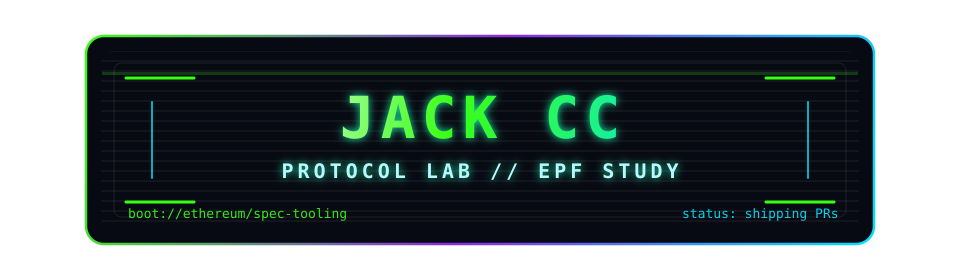

<!-- logo: https://simpleicons.org/ badge params: https://shields.io/ -->

<p align="center">
  
</p>

<p align="center">
  <b>Select Boot Sequence:</b>
  <br/><br/>
  <a href="#protocol-work">
    
  </a>
  &nbsp;
  <a href="#project-showcase">
    
  </a>
  &nbsp;
  <a href="#tech-stack">
    
  </a>
  &nbsp;
  <a href="#contact">
    
  </a>
</p>

---

> From Web3 product engineering to Ethereum core protocol. I build testable systems, sharper tooling, and developer experiences that survive real review.

---

### `System Identity`

```txt
jack@protocol-lab:~$ whoami
Jack CC / Chen Can
Graduate student in Electronic Information, focused on Ethereum protocol tooling and product-grade engineering.

jack@protocol-lab:~$ current_focus
execution-specs    fork-aware testing, t8n helpers, fixture loading, measurable spec behavior
consensus-specs    reusable test context helpers, state-transition test ergonomics
lodestar           TypeScript client tooling, validator CLI UX, docs, tests

jack@protocol-lab:~$ engineering_style
read the code -> isolate behavior -> ship small PRs -> write focused tests -> iterate with maintainers
```

---

### `GitHub Stats`

<p align="center">
  
  
</p>

---

### `Protocol Work`

| Repository | Contribution | Signal |
| :--- | :--- | :--- |
| `ethereum/execution-specs` | [PR #2738](https://github.com/ethereum/execution-specs/pull/2738) | Optimized `ForkCache` to skip cloning unchanged fork templates, with focused coverage and measured behavior. |
| `ethereum/execution-specs` | [PR #2778](https://github.com/ethereum/execution-specs/pull/2778) | Followed maintainer feedback and moved fork module loading toward the `Hardfork` abstraction. |
| `ethereum/consensus-specs` | [PR #5192](https://github.com/ethereum/consensus-specs/pull/5192) | Added infrastructure coverage for `with_custom_state` and observable behavior assertions. |
| `ChainSafe/lodestar` | [PR #9236](https://github.com/ChainSafe/lodestar/pull/9236) | Added per-keystore password support for validator import with CLI validation, docs, unit tests, and e2e coverage. |
| `eth-protocol-fellows/protocol-studies` | [PR #502](https://github.com/eth-protocol-fellows/protocol-studies/pull/502), [PR #503](https://github.com/eth-protocol-fellows/protocol-studies/pull/503) | Small protocol-study maintenance contributions while ramping into the EPF ecosystem. |

---

### `Project Showcase`

| Project | Description | Signal |
| :--- | :--- | :--- |
| `AI PR Helper MVP` | A developer tool that fetches URLs and diffs, calls an LLM API, and summarizes PR context for faster review. | AI-assisted developer tooling |
| `fastKOL` | SPARK AI Hackathon LLM track Pioneer Award project. | Hackathon shipping |
| `Web3CareerBuild` | Frontend and product engineering across application queue and program task workflows. | React / Next.js / TypeScript |
| `Protocol Study Lab` | Personal ramp-up workspace for Ethereum specs, client tooling, tests, and maintainer feedback loops. | EPF-oriented learning |

---

### `Tech Stack`

<p align="center">
  
  
  
  
  
  
  
  
</p>

```txt
protocol_tooling = ["execution-specs", "consensus-specs", "Lodestar", "fixture generation", "client DX"]
web3_engineering = ["Solidity", "Foundry", "Hardhat", "viem", "wagmi", "ERC-4337 experiments"]
product_stack    = ["React", "Next.js", "TypeScript", "browser extensions", "AI-assisted devtools"]
working_loop     = ["codebase navigation", "test debugging", "implementation draft", "human review", "final validation"]
```

---

### `Achievements`

<p align="center">
  
  
  
  
</p>

---

### `Recent Activity`

<!--START_SECTION:activity-->
<!--END_SECTION:activity-->

---

### `Runtime`

```txt
interests      = ["Ethereum core protocol", "spec tooling", "protocol tests", "client DX", "AI-assisted engineering"]
principles     = ["read the code", "make behavior measurable", "ship small PRs", "write tests", "learn in public"]
next_milestone = "become useful to Ethereum core protocol maintainers"
```

---

### `Contact`

<p align="center">
  <a href="https://github.com/JackCC703">
    
  </a>
  &nbsp;
  <a href="mailto:chencan0703@gmail.com">
    
  </a>
</p>
